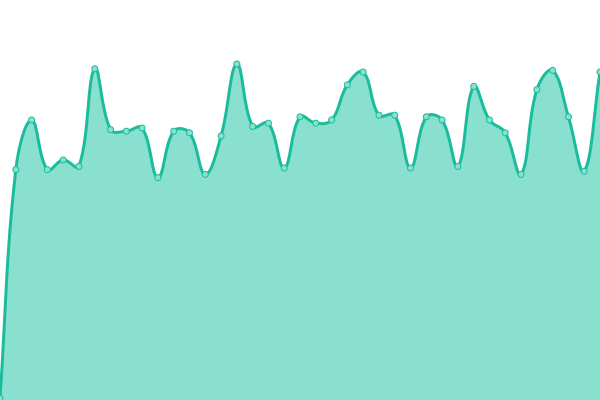
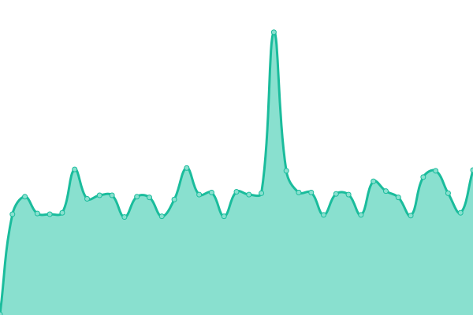

# [📈 Live Status](https://demo.upptime.js.org): <!--live status--> **🟧 Partial outage**

This repository contains the open-source uptime monitor and status page for [Upptime](https://upptime.js.org), powered by [Upptime](https://github.com/upptime/upptime).

With [Upptime](https://upptime.js.org), you can get your own unlimited and free uptime monitor and status page, powered entirely by a GitHub repository. We use [Issues](https://github.com/upptime/upptime/issues) as incident reports, [Actions](https://github.com/creativefurniture/uptime/actions) as uptime monitors, and [Pages](https://demo.upptime.js.org) for the status page.

<!--start: status pages-->
<!-- This summary is generated by Upptime (https://github.com/upptime/upptime) -->
<!-- Do not edit this manually, your changes will be overwritten -->
<!-- prettier-ignore -->
| URL | Status | History | Response Time | Uptime |
| --- | ------ | ------- | ------------- | ------ |
|  [BscScan](https://bscscan.com/) | 🟩 Up | [bsc-scan.yml](https://github.com/creativefurniture/uptime/commits/HEAD/history/bsc-scan.yml) | 

 214ms
     
 | 

<a href="https://creativefurniture.github.io/uptime/history/bsc-scan">100.00%</a>
    

|  [Etherscan](https://etherscan.io/) | 🟩 Up | [etherscan.yml](https://github.com/creativefurniture/uptime/commits/HEAD/history/etherscan.yml) | 

 149ms
     
 | 

<a href="https://creativefurniture.github.io/uptime/history/etherscan">100.00%</a>
    

|  [PolygonScan](https://polygonscan.com/) | 🟩 Up | [polygon-scan.yml](https://github.com/creativefurniture/uptime/commits/HEAD/history/polygon-scan.yml) | 

 198ms
     
 | 

<a href="https://creativefurniture.github.io/uptime/history/polygon-scan">100.00%</a>
    

|  [SnowTrace](https://snowtrace.io/) | 🟩 Up | [snow-trace.yml](https://github.com/creativefurniture/uptime/commits/HEAD/history/snow-trace.yml) | 

 211ms
     
 | 

<a href="https://creativefurniture.github.io/uptime/history/snow-trace">100.00%</a>
    

|  [OpenChain](https://openchain.xyz/) | 🟩 Up | [open-chain.yml](https://github.com/creativefurniture/uptime/commits/HEAD/history/open-chain.yml) | 

 222ms
     
 | 

<a href="https://creativefurniture.github.io/uptime/history/open-chain">100.00%</a>
    

|  Dev Server | 🟥 Down | [dev-server.yml](https://github.com/creativefurniture/uptime/commits/HEAD/history/dev-server.yml) | 

 0ms
     
 | 

<a href="https://creativefurniture.github.io/uptime/history/dev-server">0.00%</a>
    

|  ESXI Provider | 🟥 Down | [esxi-provider.yml](https://github.com/creativefurniture/uptime/commits/HEAD/history/esxi-provider.yml) | 

 0ms
     
 | 

<a href="https://creativefurniture.github.io/uptime/history/esxi-provider">0.00%</a>
    

|  Proxmox Provider | 🟥 Down | [proxmox-provider.yml](https://github.com/creativefurniture/uptime/commits/HEAD/history/proxmox-provider.yml) | 

 0ms
     
 | 

<a href="https://creativefurniture.github.io/uptime/history/proxmox-provider">0.00%</a>
    

<!--end: status pages-->

[**Visit our status website →**](https://demo.upptime.js.org)

## 📄 License

- Powered by: [Upptime](https://github.com/upptime/upptime)
- Code: [MIT](./LICENSE) © [Upptime](https://upptime.js.org)
- Data in the `./history` directory: [Open Database License](https://opendatacommons.org/licenses/odbl/1-0/)
